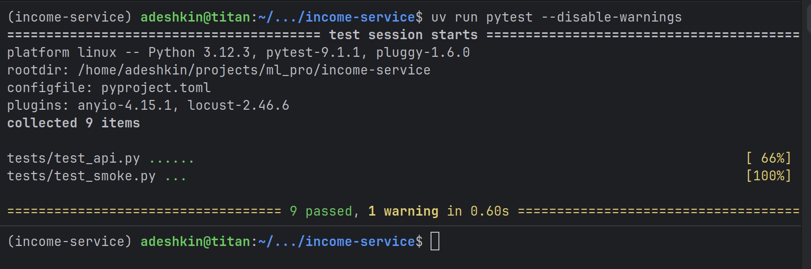
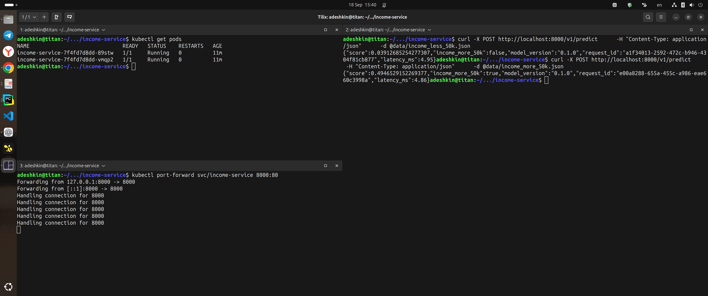

# Income Service

`income-service` — REST-сервис на FastAPI для оценки вероятности дохода выше 50 000 в год. Сервис загружает обученную модель при старте, проверяет входные данные, сохраняет результаты предсказаний в PostgreSQL и поддерживает запуск в Docker Compose и Kubernetes.

## Возможности

- одиночное и пакетное предсказание;
- проверка состояния и готовности сервиса;
- журналирование предсказаний в PostgreSQL;
- контейнерный запуск вместе с базой данных;
- Kubernetes Deployment с двумя репликами, probes и ограничениями ресурсов;
- автоматические API- и smoke-тесты.

## Требования

- Python 3.11 или 3.12;
- [uv](https://docs.astral.sh/uv/);
- Docker и Docker Compose — для контейнерного запуска;
- `kubectl` и доступный Kubernetes-кластер — для развёртывания в Kubernetes.

## Быстрый старт

```bash
git clone https://github.com/adeshkin/income-service.git
cd income-service
uv sync
uv run uvicorn income.service.app:app --host 0.0.0.0 --port 8000
```

После запуска доступны:

- API: `http://localhost:8000`;
- Swagger UI: `http://localhost:8000/docs`;
- проверка состояния: `GET /health`;
- проверка готовности: `GET /ready`.

## Запрос к модели

```bash
curl -X POST http://localhost:8000/v1/predict \
  -H "Content-Type: application/json" \
  -d @data/income_more_50k.json
```

Ответ содержит вероятность класса, итоговый признак дохода, версию модели, идентификатор запроса и время обработки:

```json
{
  "score": 0.4946529152269377,
  "income_more_50k": true,
  "model_version": "0.1.0",
  "request_id": "e00a8288-655a-455c-a986-eae660c3998a",
  "latency_ms": 4.86
}
```

Для проверки второго класса можно использовать `data/income_less_50k.json`. Пакетный маршрут доступен по адресу `POST /v1/predict/batch`.

## Тесты

```bash
uv run pytest --disable-warnings
```

Контрольный прогон завершён успешно: 9 тестов пройдено.



## Запуск через Docker Compose

```bash
docker compose up -d --build
```

Compose запускает API на порту `8000` и PostgreSQL на порту `5432`. Результаты запросов сохраняются в таблицу `predictions`.

Остановка окружения:

```bash
docker compose down
```

## Развёртывание в Kubernetes

Сначала убедитесь, что образ `income-service:1.0` доступен кластеру, затем примените манифесты:

```bash
kubectl apply -f k8s/
kubectl get pods
kubectl port-forward svc/income-service 8000:80
```

После проброса порта API доступен по адресу `http://localhost:8000`. Манифест создаёт две реплики приложения и `ClusterIP` Service.



## Подтверждение работы

Краткий отчёт с результатами тестирования, проверки БД и Kubernetes-развёртывания находится в [REPORT.md](REPORT.md).
