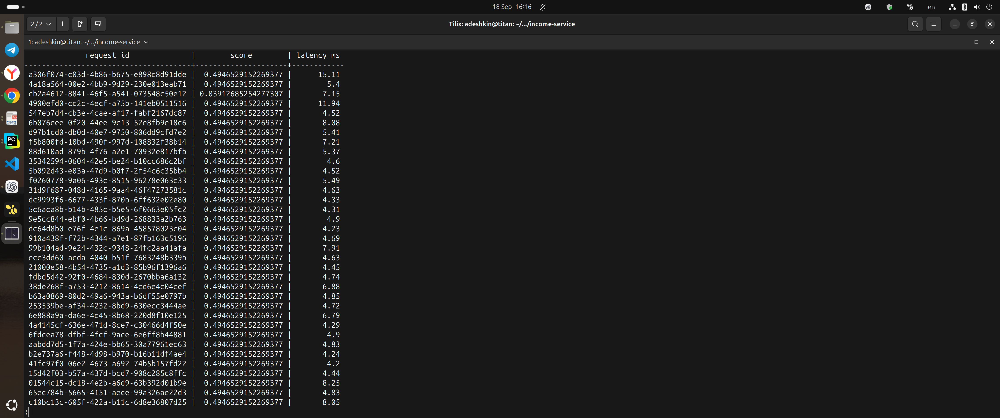
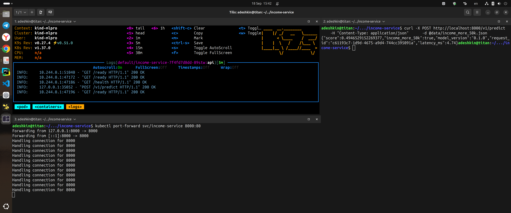
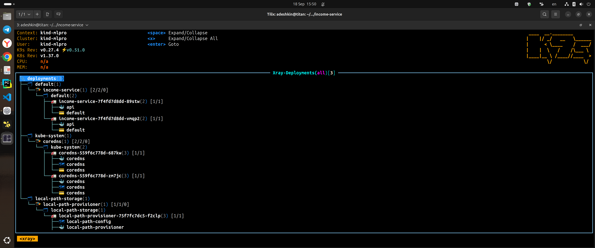

# Краткий отчёт по Income Service

## Результат

Сервис подготовлен к локальному и контейнерному запуску, проходит автоматические проверки и разворачивается в Kubernetes. По приложенным снимкам подтверждены работа API, двух реплик приложения, health/readiness-проверок и запись результатов предсказаний в PostgreSQL.

## Проверенные этапы

1. **Автоматические тесты.** Pytest собрал и успешно выполнил 9 тестов: проверки маршрутов `/health` и `/ready`, валидации входных данных, обработки пропущенных допустимых полей и стабильности предсказаний. Результат: `9 passed`, одно предупреждение, время выполнения — 0,60 с.

   

2. **Сохранение результатов.** В таблице `predictions` присутствуют записи с идентификатором запроса, оценкой модели и временем обработки. На снимке большинство запросов выполнено примерно за 4–8 мс; отдельные значения достигают 15,11 мс.

   

3. **Работа в Kubernetes.** Deployment запущен в двух репликах: оба пода находятся в состоянии `Running` и готовы принимать запросы (`1/1`). Через `port-forward` выполнены два запроса к `/v1/predict`; сервис вернул ответы для примеров с доходом ниже и выше 50 000.

   

4. **Логи приложения.** В k9s видны успешные ответы `200 OK` для `/health`, `/ready` и `/v1/predict`, что подтверждает прохождение probes и обработку запросов.

   

5. **Структура развёртывания.** В XRay отображается Deployment `income-service` с двумя готовыми подами. Kubernetes-манифесты задают startup-, liveness- и readiness-пробы, а также requests и limits для CPU и памяти.

   

## Вывод

Базовый сценарий подтверждён полностью: тесты проходят, API возвращает предсказания, результаты сохраняются в базе данных, а Kubernetes-развёртывание поддерживает две работоспособные реплики с настроенными проверками состояния.
